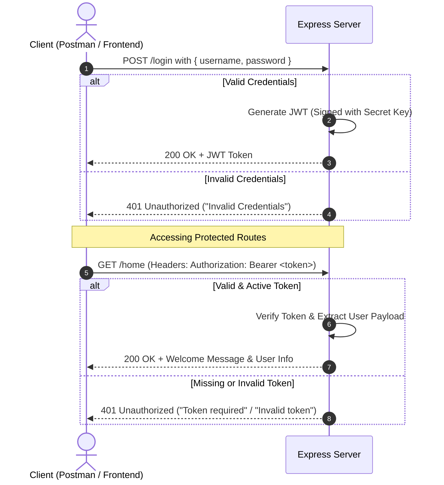

# 🔐 JWT Authentication with Express.js

A clean, beginner-friendly, and professional implementation of **JSON Web Token (JWT)** authentication using **Node.js** and **Express.js**.

---

## 📌 Overview

This project demonstrates how authentication works in modern web applications. 

When a user logs in with valid credentials, the server creates a digital pass called a **JWT (JSON Web Token)**. The client (frontend, mobile app, or Postman) stores this token and sends it in the header for any future requests to access protected pages.

---

## ✨ Features

- 🔑 **User Login API**: Validates credentials and generates a secure signed JWT.
- 🛡️ **Protected Route Middleware**: Verifies incoming tokens before granting access to sensitive routes.
- ⏳ **Token Expiration**: Automatically expires tokens after 24 hours (`1d`).
- ⚡ **Lightweight & Fast**: Minimal dependencies, easy to understand and integrate.
- 🔄 **Live Reload**: Pre-configured with `nodemon` for active development.

---

## 🛠️ Tech Stack

- **Runtime**: [Node.js](https://nodejs.org/)
- **Framework**: [Express.js](https://expressjs.com/) (v5)
- **Token Management**: [jsonwebtoken](https://github.com/auth0/node-jsonwebtoken)
- **Dev Tool**: [nodemon](https://nodemon.io/)

---

## 📁 Project Structure

```text
JWT EXPRESS BASIC CODE/
├── node_modules/         # Installed npm packages
├── package.json          # Project metadata and dependencies
├── package-lock.json     # Dependency lockfile
├── server.js             # Main server logic and route definitions
└── README.md             # Project documentation
```

---

## 🔄 How It Works (Authentication Flow)



---

## 🚀 Getting Started

Follow these simple steps to run this project locally on your machine.

### 1. Prerequisites
Make sure you have **Node.js** installed on your system.
- Check Node version: `node -v`
- Check npm version: `npm -v`

### 2. Installation
Open your terminal in the project folder and install dependencies:
```bash
npm install
```

### 3. Start the Server

- **For Development (auto-restart on file save):**
  ```bash
  npm run dev
  ```
- **For Production / Normal Run:**
  ```bash
  npm start
  ```

Your server will start and listen at:
```text
http://localhost:3000
```

---

## 🔑 Default Test Credentials

For quick testing, the credentials hardcoded in `server.js` are:

| Field | Value |
|---|---|
| **Username** | `Aditya` |
| **Password** | `qwertyuiop` |

---

## 📡 API Reference

### 1. User Login

Generate a new JWT by providing valid login credentials.

- **URL**: `/login`
- **Method**: `POST`
- **Headers**: `Content-Type: application/json`

#### Request Body:
```json
{
  "username": "Aditya",
  "password": "qwertyuiop"
}
```

#### Success Response (`200 OK`):
```json
{
  "message": "Login Successful",
  "token": "eyJhbGciOiJIUzI1NiIsInR5cCI6IkpXVCJ9..."
}
```

#### Failure Response (`401 Unauthorized`):
```json
{
  "message": "Invalid Credentials"
}
```

---

### 2. Protected Home Route

Access a protected endpoint using the Bearer token received from `/login`.

- **URL**: `/home`
- **Method**: `GET`
- **Headers**:
  ```http
  Authorization: Bearer <YOUR_JWT_TOKEN>
  ```

#### Success Response (`200 OK`):
```json
{
  "message": "Welcome to Home Page",
  "user": {
    "username": "Aditya",
    "iat": 1727030400,
    "exp": 1727116800
  }
}
```

#### Missing Token Response (`401 Unauthorized`):
```json
{
  "message": "Token is required"
}
```

#### Invalid / Expired Token Response (`401 Unauthorized`):
```json
{
  "message": "Invalid or expired token"
}
```

---

## 🧪 Testing with cURL & Postman

### Option A: Using cURL in Terminal

#### 1. Login to get a token:
```bash
curl -X POST http://localhost:3000/login \
  -H "Content-Type: application/json" \
  -d "{\"username\": \"Aditya\", \"password\": \"qwertyuiop\"}"
```

#### 2. Access the protected `/home` route:
```bash
curl -X GET http://localhost:3000/home \
  -H "Authorization: Bearer YOUR_TOKEN_HERE"
```

---

### Option B: Using Postman

1. **Login Request**:
   - Set method to `POST`.
   - Enter URL: `http://localhost:3000/login`.
   - Go to the **Body** tab → select **raw** → choose **JSON**.
   - Paste the credentials JSON and click **Send**.
   - Copy the `token` string from the response.

2. **Protected Route Request**:
   - Open a new tab and set method to `GET`.
   - Enter URL: `http://localhost:3000/home`.
   - Go to the **Authorization** tab → Select **Bearer Token** in the dropdown.
   - Paste the copied token in the **Token** field.
   - Click **Send** to see your decoded user data.

---

## 💡 Production Best Practices (Next Steps)

This repository is designed for basic learning and revision. For a production-ready application, consider:

1. **Environment Variables**: Store sensitive values like `JWT_SECRET_KEY` and `PORT` in a `.env` file using [`dotenv`](https://www.npmjs.com/package/dotenv).
2. **Password Hashing**: Never compare plain-text passwords. Use [`bcrypt`](https://www.npmjs.com/package/bcrypt) to hash passwords before storing/validating.
3. **Database Integration**: Connect to a database (e.g., MongoDB, PostgreSQL) to manage dynamic users.
4. **Refresh Tokens**: Implement refresh tokens to securely extend user sessions without requiring frequent logins.

---

## 📄 License

This project is licensed under the [ISC License](LICENSE).
